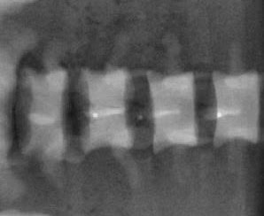
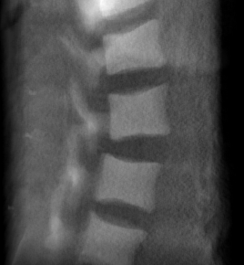

<h1 align="center">SpineStyle: Reimagining Style Transfer on Radiographs for Image-Guided Spine Surgery </h1>

<p  align="center">  
  
Intraoperative radiographs are crucial for `image-guided robotic surgery` of the spine, facilitating essential tasks such as `2D/3D registration` and `3D reconstruction`. Ensuring stylistic consistency between input radiographs and digitally reconstructed radiographs (DRRs) is pivotal for training deep learning models used in these tasks. While `neural style transfer` techniques have seen extensive application in artistic imagery, their adoption in medical imaging, particularly spinal radiographs, remains limited. This work introduces `SpineStyle`, an advanced end-to-end pipeline that employs a modified `VGG-19` architecture to perform style transfer from DRRs to input radiographs. Unlike traditional `generative adversarial network` (GAN) approaches that demand large datasets, SpineStyle achieves superior results using single input and DRR images.
</p>

<h3 > <i>Index Terms</i> </h3> 

 :diamond_shape_with_a_dot_inside:Image-guided surgery
  :diamond_shape_with_a_dot_inside: Style Transfer
  :diamond_shape_with_a_dot_inside:Deep Learning

</div>

## <div align="center">Features</div>

- **End-to-End Style Transfer Pipeline**: Seamlessly transfers DRR style onto input radiographs.
  <br/>
  
- **Modified VGG-19 Architecture**: Enhances style transfer accuracy and anatomical integrity.
- **📊 Novel Evaluation Metrics**:
  - **`Style Transfer Extent (STE)`**: Quantifies the degree of style transfer from DRR to input radiograph.
  - **`Semantic Content Loss Measure (SCLM)`**: Determines the retention of anatomical details post style transfer.
- **Superior Performance 🚀**: Outperforms standard neural style transfer methods in rigorous comparative studies.
  
## <div align="center">Getting Started</div>

<details>
<summary><i>DRR Generation from CT</i></summary>

Digitally Reconstructed Radiographs (DRRs) are simulated from CT volumes using Plastimatch, ensuring accurate representation of spinal structures in different views:

- **Rotational Simulation**: DRRs are generated in a 360° circular orbit around the CT isocenter, producing views corresponding to anteroposterior (AP) and lateral (LP) perspectives.
- **Selection Process**: Two DRRs per X-ray view are selected based on rotational angles to match the orientation of clinical X-ray images.
<div align="center">
<div style="display: flex; flex-direction: row;">
    
    &nbsp;&nbsp;&nbsp;&nbsp;&nbsp;&nbsp;&nbsp;&nbsp;&nbsp;&nbsp;&nbsp;&nbsp;&nbsp;&nbsp;&nbsp;&nbsp;&nbsp;&nbsp;&nbsp;&nbsp;&nbsp;&nbsp;&nbsp;&nbsp;
     
</div>
</div>
 <p>&nbsp;&nbsp;&nbsp;&nbsp;&nbsp;&nbsp;&nbsp;&nbsp;&nbsp;&nbsp;
   
   :small_orange_diamond: Fig 1: DRR for Anterior-Posterior of Spine 
   &nbsp;&nbsp;&nbsp;&nbsp;&nbsp;&nbsp;&nbsp;&nbsp;&nbsp;&nbsp;&nbsp;&nbsp;&nbsp;&nbsp;&nbsp;&nbsp;&nbsp;&nbsp;&nbsp;&nbsp;&nbsp;&nbsp;&nbsp;&nbsp;&nbsp;&nbsp;&nbsp;&nbsp;&nbsp;
   :small_orange_diamond: Fig 2: DRR for Lateral-Posterior of Spine</p>

</details>
<details>
<summary><i>Basic Image Processing</i></summary>


X-ray images of the spine undergo preprocessing steps to enhance quality and prepare for style transfer:

- **Preprocessing Pipeline**: Includes Gaussian blurring, `Contrast Limited Adaptive Histogram Equalization (CLAHE)`, median blurring, and `Non-Local Means (NL-means)` denoising.
- **Normalization**: Normalizes X-ray images and DRRs to a mean of 0.521 and standard deviation of 0.224 before feeding into the SpineStyle model.
  <br/>
  
  </details>
  
  <details>
<summary><i>Style Transfer Model - SpineStyle</i></summary>

The SpineStyle pipeline utilizes an adapted version of VGG-19, pretrained on ImageNet, for style transfer between
`X-ray images and DRRs`:

- **Architecture Adaptation**: Utilizes the first 16 convolutional layers of VGG-19 as feature extractors, with removal of fully connected layers and output classification layer.
- **Pooling Modification**: Replaces max pooling layers with average pooling to capture broader style features such as texture and intensity distribution.
- **Normalization Adjustment**: Substitutes batch normalization with instance normalization for improved performance in single-image style transfer tasks.

  
  </details>
  
  <details>
<summary><i>Losses and Implementation Details</i></summary>

- **Loss Functions**: Includes Content Loss, Style Loss using Gram matrices, and Total Variation Loss for regularization, weighted according to experimental needs.
- **Optimization**: Employs Limited Memory BFGS as the optimizer, selected for its effectiveness in synthesizing high-quality images.
  <br/>
  
  </details>
  
  <details>
<summary><i>Results and Evaluation</i></summary>

- **Style Transfer Results**: Demonstrates successful integration of X-ray content with DRR style, validated through visual outputs.

<p align="center">
  
</p>

<div align = "center">
  
  :small_orange_diamond: Figure 3 : Style Transfer results - Content image (left), Style Image (middle) and Style
Transferred Ouput (right) of AP Spine image
  
</div>


<p align="center">
  
</p>

<div align = "center">
  
  :small_orange_diamond: Figure 4 : Style Transfer results - Content image (left), Style Image (middle) and Style
Transferred Ouput (right) of LP Spine image
  
</div>
 
- **Comparative Histogram Study**: Evaluates fidelity of intensity mappings between X-ray images, DRRs, and style transferred outputs.
- **Semantic Content Loss Measure (SCLM)**: Introduces metric for assessing content preservation via feature map comparisons across VGG-19 convolutional blocks.
</details>


## <div align="center">Methodology</div>

<p align="center">
  
</p>

<div align = "center">
  
  :small_orange_diamond: Figure 5: Block diagram of proposed work
  
</div>

## <div align="center">Acknowledgements</div>
Before installing and running the project, ensure you have the following prerequisites:
  
  :grey_exclamation: **For DRR generation using Plastimatch** ( file : *DRR Generation*)
 
 :wavy_dash:  See the [PerX2CT](https://github.com/dek924/PerX2CT) for full documentation on deployment.
 
:wavy_dash: Paper Title: PerX2CT - Perspective Projection-Based 3D CT Reconstruction from Biplanar X-rays

 <br/>
 
:grey_exclamation: **For general structure of VGG-19** ( file: *VGG-19*)

:wavy_dash:  See the [Neural Transfer Using PyTorch](https://pytorch.org/tutorials/advanced/neural_style_tutorial.html) for the official Pytorch tutorial for neural style transfer

 
## <div align="center">Installation</div>
:arrow_right:Clone the Repository
```bash
git clone https://github.com/Deepa-Ramki/Spine-Style-Reimagining-Style-Transfer-on-Radiographs.git
```

:arrow_right:Navigate to the Project Directory
```bash
cd Spine-Style-Reimagining-Style-Transfer-on-Radiographs
```
:arrow_right:Install Dependencies
```bash
pip install -r requirements.txt
```


## <div align="center">Environments</div>

<div align="center">
  <a href="https://jupyter.org/">
    </a>
  
  <a href="https://www.spyder-ide.org/">
    </a>
</div>

